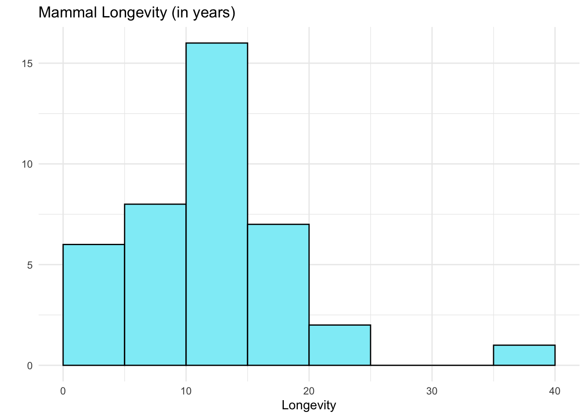

# Unit 1-6 {-}

## Unit 1.6 –  Distributions of Quantitative Data: Dotplots & Histograms {-}

Given a quantitative data set, we can use frequency distributions to summarize the data and identify trends and patterns.  Here is a random sample of 40 mammal longevities.

The dotplot below summarizes the distribution of mammal longevities.


In a dotplot, we can see the position (location) of all of the individual data values.  So we can see that the lowest data value is a 1, the maximum data value is 40, there are five 20’s, and so forth.  

We can see that the center of the distribution is near 12 years.  This is the value which represents the average, most usual, or most common value in the data set.  The shape is skewed right since the majority of values are on the left-side of the distribution.  The spread can be described by the range, which is the distance between the lowest and greatest data values.  This data set has a range of 40 – 1 = 39 years.  The mammal longevities in the sample span a range of 39 years.

We can also use a histogram to show the distribution.  


```
#>           Animal     Gestation        Longevity    
#>  baboon      : 1   Min.   : 15.00   Min.   : 1.00  
#>  bear,black  : 1   1st Qu.: 66.75   1st Qu.: 8.00  
#>  bear,grizzly: 1   Median :175.50   Median :12.00  
#>  bear,polar  : 1   Mean   :194.32   Mean   :13.15  
#>  beaver      : 1   3rd Qu.:262.25   3rd Qu.:15.25  
#>  buffalo     : 1   Max.   :645.00   Max.   :40.00  
#>  (Other)     :34
```



The histogram shows the number of data values that are contained in non-overlapping classes.  We can no longer see the individual data values, but we can see the classes that contain the most data values, and the least number of data values. 

The histogram above has a bin width of **5**. The first class contains values between 1 and 5, the second class contains values between 6 and 10, the third class contains values between 11 and 15, and so on.  We can see from the histogram that the majority of longevities are between 6 and 20.  The shape is skewed right. Like a dotplot, a histogram allows us to observe characteristics of a quantitative data set.

## Summary {-}

## Practice Problems {-}

1.
2.
3.
