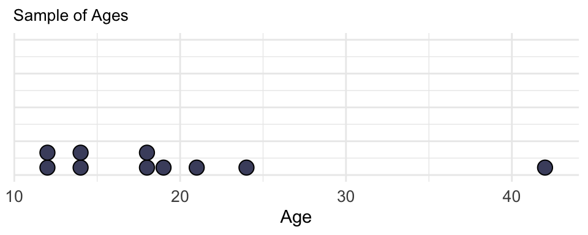
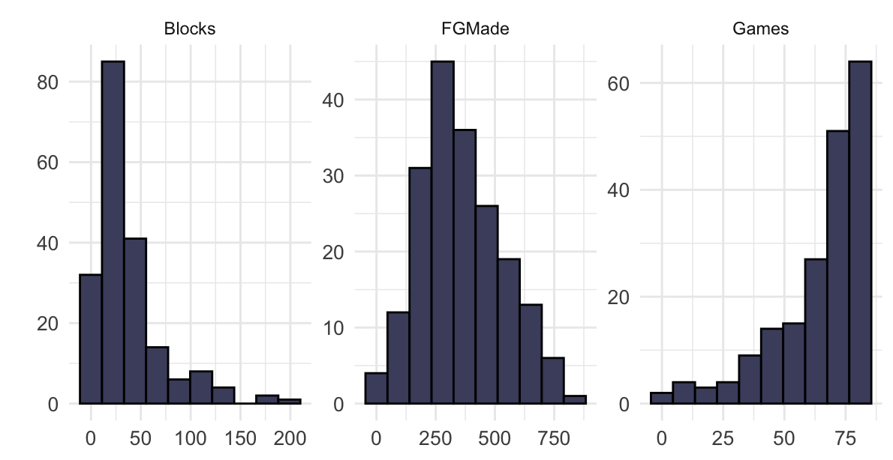

# Unit 1-7 {-}

## Unit 1.7 Measures of Center {-}

The measures of center introduced in this unit are the **mean** and **median**. The mean is the average of the data values, and the median is the data value in the middle position, or the average of middle two data values, when the data are ordered.  The mean and median provide important information about a data set.

**Example 1** – Find the mean and median of the following data set containing a sample of 10 ages. The ages are from 10 people randomly selected from a gym in a community center.

**Ages**: 12, 12, 14, 14, 18, 18, 19, 21, 24, 42

Here is a dotplot of the ages.

The mean of the sample, denoted by $\bar{x}$.  

The sample mean is $\bar{x}$ = (12 + 12 + 14 + 14 + 18 + 18 + 19 + 21 + 24 + 42) / 10 = **19.4 years**.

To find the median of a list of numbers, we first order the list.  

The ordered list is: 12, 12, 14, 14, 18, 18, 19, 21, 24, 42

- If the list has an even number of values, the median is the mean of the middle two numbers.

- If the list has an odd number of values, the median is the middle number in the list.

In the list above, there are 10 numbers, so the median the _average of the middle two numbers_ (when the list is ordered), which is (18 + 18) / 2 = **18 years**.

**DESMOS** – Click on (or copy in) this Desmos link to see the dotplot and how the mean and median
can be computed. https://www.desmos.com/calculator/wxvrp2gxgs

### Comparing the Mean vs. Median {-}

Which measure (mean or median) better describes the typical age in this sample? The median is preferred, since the median is not impacted by the extreme value of 42. The age of 42 is very large compared to the rest of the data values. The median only uses the number (or numbers) in the middle of the ordered list. The mean is greater than the median since the extremely high value of 42 influences the mean, but has no impact on the median. The data set has a skewed right shape (from the dotplot), and when data are skewed, the median better describes a typical data value in the data set than the mean.

## More Examples {-}

We learned about shapes of distributions in Collaboration 1.7.  The graph below displays three histograms, each with a different shape.

The histograms summarize data for 193 players in the NBA for the 2019 season. In the histograms above, the number of blocks per player is **skewed right**, the number of field goals made per player is **approximately symmetric**, and the number of games played per player is **skewed left**.

## Summary {-}

Here are some main points from Unit 1.7:

- The mean and median provide us values that are representative of an entire data set.

- The mean is calculated using all of the values in a data set.

- The median is based on the number, or numbers, in the middle of a data set.

- The median is the best measure of center for data that are skewed. This is because, unlike the mean, extreme values which cause skewing have little impact on the median. The median is resistant to the extreme values but the mean is not resistant to these extreme values.

## Practice Problems {-}

1.
2.
3.
