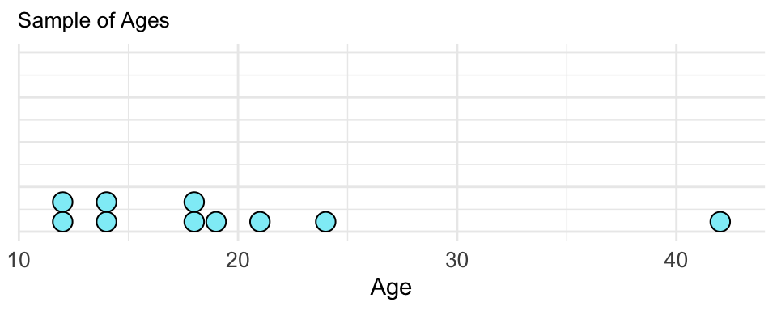

# Unit 1-9 {-}

## Unit 1.9 Measures of Variability from the Mean {-}

The focus of this unit is understanding a measure of variability based on the **mean** of a data set. A measure of variability is a measure of spread. The measure of variability that is based on the mean is the **standard deviation**. The standard deviation is a measure of the typical (or average) deviation of data values in a data set.

### Example {-}

Let's return to the sample of ages from the Unit 1.7 notes. The ages are from 10 people randomly selected from a gym in a community center.  Use the standard deviation to quantify the typical deviation from the mean age in the sample. 

**Ages**: 12, 12, 14, 14, 18, 18, 19, 21, 24, 42

**Solution**
Here is a dotplot of the ages.

The mean of the sample, $\bar{x}$ , is **19.4 years**. Each data value has a deviation from the mean. A data value’s deviation from the mean is found by: __value – mean__. The table below displays each data value and each data value’s deviation from the mean. The right column contains the calculations and the resulting deviations.

<table style="font-size:16px">
  <tr>
    <th><b>Values</b></th>
    <th><b>Deviations from mean</b></th>
  </tr>
  <tr>
    <td>12</td>
    <td>12 - 19.4 = -7.4</td>
  </tr>
  <tr>
    <td>12</td>
    <td>12 - 19.4 = -7.4</td>
  </tr>
  <tr>
    <td>14</td>
    <td>14 - 19.4 = -5.4</td>
  </tr>
  <tr>
    <td>14</td>
    <td>14 - 19.4 = -5.4</td>
  </tr>
  <tr>
    <td>18</td>
    <td>18 - 19.4 = -1.4</td>
  </tr>
  <tr>
    <td>18</td>
    <td>18 - 19.4 = -1.4</td>
  </tr>
  <tr>
    <td>19</td>
    <td>19 - 19.4 = -0.4</td>
  </tr>
  <tr>
    <td>21</td>
    <td>21 - 19.4 = 1.6</td>
  </tr>
  <tr>
    <td>24</td>
    <td>24 - 19.4 = 4.6</td>
  </tr>
  <tr>
    <td>42</td>
    <td>42 - 19.4 = 22.6</td>
  </tr>
</table>

Note that some of the deviations are positive, and some are negative. The key question is, “What is the average of these deviations?” Well, we cannot just add up the deviations and divide by the number of deviations, because some are positive and some are negative. The sum of the deviations is actually 0.

Another key question is, “If you ignore the negative signs, what is the average of the deviations?” The average of the deviations is essentially the average distance that data values are from the mean.

To find the standard deviation, we actually __square__ the deviations to obtain non-negative values. The table below shows the squared deviations.  The left column contains the data values, the middle column contains their deviations from the mean, and the right column contains the squared deviations.

<table style="font-size:16px">
  <tr>
    <th><b>Values</b></th>
    <th><b>Deviations</b></th>
     <th><b>Squared deviations</b></th>
  </tr>
  <tr>
    <td>12</td>
    <td>12 - 19.4 = -7.4</td>
    <td>(-7.4)^2^ = 54.76</td>
  </tr>
  <tr>
    <td>12</td>
    <td>12 - 19.4 = -7.4</td>
    <td>(-7.4)^2^  = 54.76</td>
  </tr>
  <tr>
    <td>14</td>
    <td>14 - 19.4 = -5.4</td>
    <td>(-5.4)^2^ = 29.16</td>
  </tr>
  <tr>
    <td>14</td>
    <td>14 - 19.4 = -5.4</td>
    <td>(-5.4)^2^ = 29.16</td>
  </tr>
  <tr>
    <td>18</td>
    <td>18 - 19.4 = -1.4</td>
    <td>(-1.4)^2^ = 1.96</td>
  </tr>
  <tr>
    <td>18</td>
    <td>18 - 19.4 = -1.4</td>
    <td>(-1.4)^2^ = 1.96</td>
  </tr>
  <tr>
    <td>19</td>
    <td>19 - 19.4 = -0.4</td>
    <td>(0.4)^2^ = 0.16</td>
  </tr>
  <tr>
    <td>21</td>
    <td>21 - 19.4 = 1.6</td>
    <td>(1.6)^2^ = 2.56</td>
  </tr>
  <tr>
    <td>24</td>
    <td>24 - 19.4 = 4.6</td>
    <td>(4.6)^2^ = 21.16</td>
  </tr>
  <tr>
    <td>42</td>
    <td>42 - 19.4 = 22.6</td>
    <td>(22.6)^2^ = 510.76</td>
  </tr>
</table>

We now find the **sample variance**. The sample variance is a rough average of the squared deviations. To find this average, we actually divide the sum of the squared deviations by number of squared deviations minus 1, which is the sample size **(n)** minus 1. The sample variance is denoted **s^2^**.

$$s^2 = \frac{\text {Sum of squared  deviations} }{n - 1}$$

$$s^2 = \frac{\text {54.76 + 54.76 + ... + 21.26 + 510.76} }{10 - 1} = \frac{706.4}{9} \approx 78.49$$

The sample standard deviation is the square root of the sample variance. The sample standard deviation is denoted by **s**.

$$s = \sqrt{78.49} \approx 8.86$$

The sample standard deviation of 8.6 describes the average, or typical, deviation of data values from the sample mean. In the data set above, the mean age is 19.4 years. So we can conclude that the data values have an average deviation from the mean of 8.6 years. 

### Impact of Outliers {-}

All of the ages, except 42, are closer to the mean than 8.6 years. Based on this, a person could argue that 8.6 years does not describe the variability from the mean in an accurate manner. Note that the extreme value of 42 has a deviation of 22.6 years.  This one very high deviation causes the average of the deviations to be very large. Thus, 42 has a significant impact on the standard deviation. This data set is skewed right due to the outlier, so the interquartile range (IQR) would be a better measure of spread to use.  In most cases, the IQR is not impacted by outliers.

### Units of Standard Deviation {-}

The units of the sample mean and sample standard deviation are always the same. In this example, both the mean and standard deviation is measured in years.

**DESMOS** – Click on this Desmos link to see how the sample standard deviation can be computed. We use the **STDEV** command to easily compute the standard deviation of a sample. https://www.desmos.com/calculator/rn3usvlxrk

## Summary {-}

Here are some main points from Unit 1.9:

- We calculate the IQR using the median. We calculate the standard deviation using the mean.

- Mean and standard deviation go together. Median and IQR go together.

- Both the mean and standard deviation are influenced by outliers and skew.

- When the data are skewed or contain outliers, we usually use the median and IQR to summarize the data. When the data are reasonably symmetric we use the mean and standard deviation. In addition, these summary values are never enough. We should always look at a graph as well. This can be a dotplot, histogram, or boxplot.

## Practice Problems {-}

1.
2.
3.
