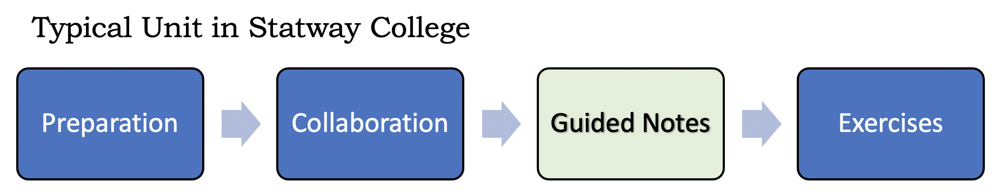

--- 
title: "Statway College - Guided Notes"
author: "Andre Freeman"
date: "2021-12-20"
site: bookdown::bookdown_site
documentclass: book
bibliography: [book.bib, packages.bib]
# url: your book url like https://bookdown.org/yihui/bookdown
# cover-image: path to the social sharing image like images/cover.jpg
description: |
  This is a minimal example of using the bookdown package to write a book.
  The HTML output format for this example is bookdown::bs4_book,
  set in the _output.yml file.
biblio-style: apalike
# csl: chicago-fullnote-bibliography.csl
---

# Welcome {-} 

## Statway College Guided Notes: Introduction {-}

These guided notes are intended to support students in **Statway College**, and are intended for students to use _after_ complete completing the collaborations. 

## How to Best Use These Notes {-}

After completing a collaboration, read through the examples in the guided notes to gain a deeper understanding of the concepts and procedures introduced in the collaboration. Take your time.  Carefully read the explanations and make sure the steps make sense to you.  At the end of the notes you will see **Practice Problems** and **Solutions**.  Complete these problems to get additional practice.

## Acknowledgements {-}

Special thanks to all Carnegie Math Pathways faculty for their contributions to these guided notes.

